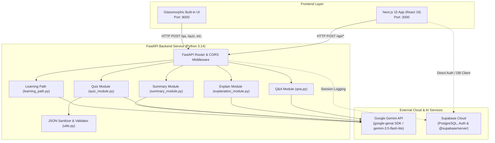
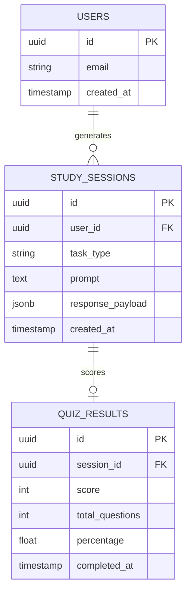
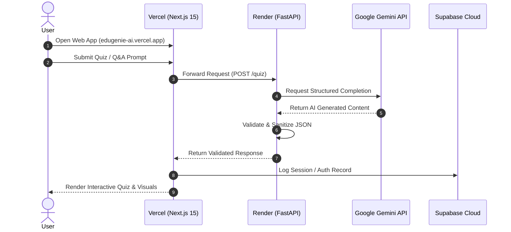

# 🎓 EduGenie AI: Complete System Architecture & Technical Specification

> **Project Name:** EduGenie AI  
> **Repository:** [https://github.com/Naveen650-gt/EduGenie-AI](https://github.com/Naveen650-gt/EduGenie-AI)  
> **Core AI Engine:** Google Gemini 3.5 Flash  
> **Database & Auth:** Supabase (Server & Client)  
> **Backend Framework:** FastAPI (Python 3.14)  
> **Frontend Framework:** Next.js 15 & React 19 (TypeScript) + Built-in Glassmorphic UI  

---

## 📑 Table of Contents
1. [Executive Summary & Problem Statement](#1-executive-summary--problem-statement)
2. [End-to-End System Architecture](#2-end-to-end-system-architecture)
3. [Component Breakdown](#3-component-breakdown)
   - [A. FastAPI Backend Service](#a-fastapi-backend-service)
   - [B. AI Feature Engine & Prompt Pipelines](#b-ai-feature-engine--prompt-pipelines)
   - [C. Next.js 15 & React 19 Client Application](#c-nextjs-15--react-19-client-application)
   - [D. Built-in Glassmorphic Web App](#d-built-in-glassmorphic-web-app)
   - [E. Supabase Database & Authentication](#e-supabase-database--authentication)
4. [API Endpoints & Data Contracts](#4-api-endpoints--data-contracts)
5. [Database Schema & Data Flow](#5-database-schema--data-flow)
6. [Security, Environment Variables & Configuration](#6-security-environment-variables--configuration)
7. [Production Deployment & DevOps Guide](#7-production-deployment--devops-guide)

---

## 1. Executive Summary & Problem Statement

**EduGenie AI** is a next-generation intelligent educational assistant designed to personalize learning workflows for students, educators, and lifelong learners. Traditional learning platforms present static content; EduGenie AI transforms static study materials into interactive, multimodal learning experiences through 5 specialized modules:

- **❓ Smart Q&A:** Context-aware conceptual answering with simplified examples.
- **💡 Concept Tutor:** Multi-level explanations formatted for rapid comprehension.
- **🎯 Quiz Master:** Automatic generation of validated 4-option MCQs with real-time scoring.
- **📝 Text Summarizer:** High-yield key takeaway extraction for exam revision.
- **🗺️ Learning Roadmap Generator:** Customized milestones and project recommendations.

---

## 2. End-to-End System Architecture

---

## 3. Component Breakdown

### A. FastAPI Backend Service
- **File:** `main.py`
- **Framework:** FastAPI with Uvicorn server (`uvicorn main:app --host 127.0.0.1 --port 8000`)
- **Key Responsibilities:**
  1. Handles CORS negotiation for localhost and deployed production origins.
  2. Enforces input validation using Pydantic schemas (`QuestionRequest`, `TextRequest`, `QuizRequest`, `LearningPathRequest`).
  3. Renders the server-side Jinja2 template for the built-in UI at `GET /`.
  4. Manages global exception handling returning standardized JSON error payloads.

---

### B. AI Feature Engine & Prompt Pipelines

#### 1. Smart Q&A (`qna.py`)
- System prompt instructs the model to act as a friendly tutor, prioritizing direct answers followed by simplified real-world analogies.
- **Model:** `gemini-3.5-flash-lite`
- **Temperature:** `0.3` (Low randomness for academic accuracy).

#### 2. Concept Explainer (`explanation_module.py`)
- Formats topics into a structured 5-part breakdown:
  1. Simple definition
  2. How it works
  3. Key points
  4. Easy example
  5. One-line recap

#### 3. Quiz Generator (`quiz_module.py` & `utils.py`)
- Instructs Gemini to output strict JSON schemas containing multiple-choice questions.
- `utils.clean_json_block()` strips potential markdown fences and regex-extracts the valid JSON envelope.
- Validates question structure: exactly 4 options per question, correct answer matching one of the options, and short explanations.

#### 4. Text Summarizer (`summary_module.py`)
- Extracts high-yield revision notes and concise summaries from pasted lecture notes or research papers without hallucinations.

#### 5. Learning Path Generator (`learning_path.py`)
- Creates multi-phase study roadmaps adjusted for mastery level (`beginner`, `intermediate`, `advanced`) with weekly timelines and project ideas.

---

### C. Next.js 15 & React 19 Client Application

- **Directory:** `edugenie-ai/`
- **Core Technologies:** Next.js 15 (App Router), React 19, TypeScript, `@supabase/server`, `@supabase/supabase-js`.
- **Architectural Highlights:**
  - **API Route Proxies:** `app/api/qa/route.ts`, `app/api/quiz/route.ts`, etc. enable secure server-to-server communication.
  - **Interactive State Engine:** `app/page.tsx` manages live tabs, preset triggers, character counters, quiz scoring algorithms, and Web Speech API audio synthesis.
  - **Supabase Integration:** `lib/supabase.ts` and `lib/supabaseServer.ts` provide hybrid client/server database queries and auth sessions.

---

### D. Built-in Glassmorphic Web App

- **Files:** `templates/index.html`, `static/style.css`, `static/app.js`
- **Features:**
  - Dynamic **Glassmorphism design system** with glowing radial background gradients.
  - **Theme Engine:** Instant Dark / Light mode toggling persisted in `localStorage`.
  - **Audio Text-to-Speech:** Browser-native speech synthesizer with play/stop controls.
  - **Interactive Quiz Player:** Real-time answer validation, option disabling, score banner, and explanation reveal.
  - **Study History Drawer:** Slide-out panel caching past queries in local memory.
  - **Export Suite:** 1-click download as Markdown (`.md`) or Quiz (`.json`).

---

### E. Supabase Database & Authentication

- **Host:** `https://ytzskfaeevhotviurven.supabase.co`
- **Packages:** `@supabase/server`, `@supabase/supabase-js`, `@supabase/ssr`, `supabase` (Python)
- **Integration Points:**
  - Browser auth and real-time database querying via `edugenie-ai/lib/supabase.ts`.
  - Server-side context verification via `edugenie-ai/lib/supabaseServer.ts`.
  - Backend session logging via `supabase_client.py`.

---

## 4. API Endpoints & Data Contracts

| Method | Endpoint | Description | Request Body | Sample Response |
| :--- | :--- | :--- | :--- | :--- |
| `GET` | `/health` | System health check | None | `{"status":"ok","service":"EduGenie"}` |
| `POST` | `/qa` | Answer student questions | `{"question": "string"}` | `{"success": true, "result": "Answer..."}` |
| `POST` | `/explain` | Explain concept | `{"text": "string"}` | `{"success": true, "result": "Explanation..."}` |
| `POST` | `/quiz` | Generate MCQ quiz | `{"text": "string", "num_questions": 5}` | `{"success": true, "result": {"questions": [...]}}` |
| `POST` | `/summarize` | Summarize notes | `{"text": "string"}` | `{"success": true, "result": "Summary..."}` |
| `POST` | `/learn/recommendations` | Create learning roadmap | `{"topic": "string", "level": "beginner"}` | `{"success": true, "result": "Roadmap..."}` |

---

## 5. Database Schema & Data Flow

---

## 6. Security, Environment Variables & Configuration

### Environment Variables Matrix

| Variable | Scope | Description |
| :--- | :--- | :--- |
| `GEMINI_API_KEY` | Backend | Google GenAI API authentication key |
| `GEMINI_MODEL` | Backend | Model identifier (`gemini-3.5-flash-lite` or `gemini-2.5-flash`) |
| `SUPABASE_URL` | Backend & Next.js | Supabase project URL |
| `SUPABASE_PUBLISHABLE_KEY` | Backend & Next.js | Supabase public anonymous key |
| `SUPABASE_SECRET_KEY` | Backend & Next.js | Supabase service/secret key for admin actions |
| `NEXT_PUBLIC_FASTAPI_URL` | Next.js Frontend | Base URL of the running FastAPI server |

---

## 7. Production Deployment & DevOps Guide

### Production Checklist
1. **GitHub Repository:** Commits pushed to `https://github.com/Naveen650-gt/EduGenie-AI`
2. **Backend Deployment (Render / Railway):**
   - Build: `pip install -r requirements.txt`
   - Start: `uvicorn main:app --host 0.0.0.0 --port $PORT`
3. **Frontend Deployment (Vercel):**
   - Root Directory: `edugenie-ai`
   - Framework Preset: Next.js
   - Environment Variables: Linked to Render backend URL.
